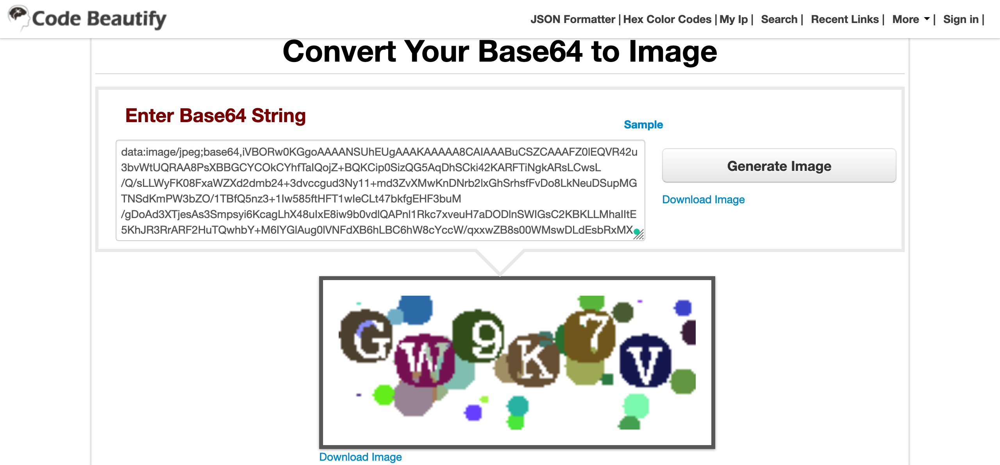
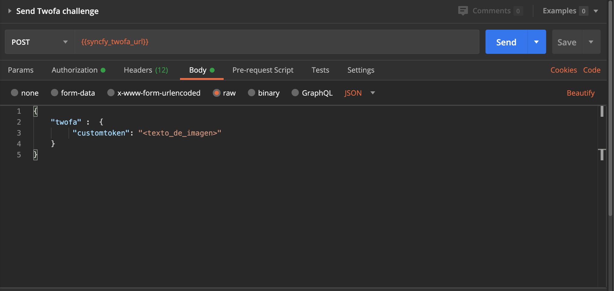

# SAT - Declara anuales/mensuales

- [Requisitos](#requisitos)
- [Primeros Pasos](#primeros-pasos)        
    - [Configurar Postman](#configurar-postman)                
        - [Importar colección](#importar-colección)                
        - [Variables de la colección en Postman](#variables-de-la-colección-en-postman)            
        - [Configurar variables de colección en Postman](#configurar-variables-de-colección-en-postman)
- [Uso de la colección](#uso-de-la-colección)
    - [1. Listar usuarios](#1-listar-usuarios)    
    - [2. Crear usuario](#2-crear-usuario)
    - [3. Iniciar sesión](#3-iniciar-sesión)
    - [4. Crear credencial](#4-crear-credencial)
    - [5. Consultar status de la credencial](#5-consultar-status-de-la-credencial)
    - [6. Enviar reto TWOFA](#6-enviar-reto-twofa)
    - [7. Listar transacciones](#7-listar-transacciones)

## Requisitos

- Syncfy API KEY
- Webhook

## Primeros Pasos

### Configurar Postman

##### Importar colección
Importa la siguiente colección a postman
[Colección de peticiones para SAT Declara anuales](<https://github.com/Paybook/code-samples/tree/master/SAT/Declacra anuales/postman>).

Ahora tienes listos los request que usaremos así como las variables que la colección ocupa para cada uno de los request.

Las variables se explican a continuación.

##### Variables de la colección en Postman

| **Variable**            | **Descripción**| **Configuración**|
| ----------------------- | ----------------------------- | ------------------------------- |
| syncfy_api_key            | API KEY entregada por Syncfy                           |Manual|
| syncfy_id_sat_declara_site       | ID de sitio de SAT Declara Anuales: *59aefe28056f29793a58c091*                 |Predefinida|
| syncfy_username           | Nombre del usuario que le asignaremos                   |Manual|
| syncfy_id_user            | ID del usuario generado al crear al usuario                  |Automático|
| syncfy_token              | Token de sesión de usuario                                   |Automático|
| sat_declara_username | Nombre de usuario (RFC) para el sitio SAT Declara Anuales |Manual|
| sat_declara_password | Contraseña para el sitio SAT Declara Anuales |Manual|
| syncfy_status_url | Endpoint para consultar el status de la credencial |Automático|
| syncfy_twofa_url | Endpoint para realizar la prueba TWOFA para la credencial |Automático|
| id_credential | ID de credencial generada al crear la credencial  |Automático|

#### Configurar variables de colección en Postman

Ahora configura las variables de la colección estableciendo el valor actual(Current value) de las variables:
- ***syncfy_api_key***: Tu API Key
- ***syncfy_username***: El nombre que tendrá el usuario que se creara
- ***sat_declara_username***: Nombre de usuario (RFC) para el sitio
- ***sat_declara_password***: Contraseña para el sitio
    
De la siguiente forma: 
> ***Syncfy SAT Declara Anuales*** > ... > Edit > Variables <br>

No es necesario definir las otras variables, se definen automáticamente tras ejecutar el respectivo request.

### Uso de la colección

#### 1. Listar usuarios
Solo hace falta ejecutar el request ***Get users linked to an API key***

#### 2. Crear usuario
Ejecuta el request ***Creates a new user*** para crear un usuario nuevo

#### 3. Iniciar sesión
Ejecuta el request ***Inits session*** para obtener un token de sesión

#### 4. Crear credencial
Ejecuta el request ***Create Credential for Sat Declara*** para crear la credencial

#### 5. Consultar status de la credencial
Ejecuta el request ***Check credentials sync status Copy*** para obtener el status de la credencial, en la respuesta verás algo similar a esto:

```json
{
    "rid": "fb469771-9629-46ab-b26c-e5e00f6be979",
    "code": 200,
    "errors": null,
    "status": true,
    "message": null,
    "response": [
        {
            "code": 100
        },
        {
            "code": 101
        },
        {
            "code": 410,
            "address": "https://sync.paybook.com/v1/jobs/5effb7e8aa8ded38b20a59fc/twofa",
            "twofa": [
                {
                    "imgBase64File": "data:image/jpeg;base64,iVBORw0KGgoAAAANSUhEUgAAAKAAAAA8CAIAAABuCSZCAAAFZ0lEQVR42u3bvWtUQRAA8PsXBBGCYCOkCYhfTaIQojZ+BQKCip0SizQG5AqDhSCki42KARFTiNgkARsLCwsL/Q/sLLWyFK08FxaWZXd2dmb24+3dvccgud3Ny11+md3ZvXMwKnDNrb2lxGhSrhsfFvDo8LkNeuDSupMGTNSdKmPW3bZO/1TBfQ5nz3+1Iw585ftHFT1wIeCLt47bkfgEHF3buM/gDoAd3XTjesAs3Smpsyi6KcagLhX48uIxE8iw9b0vdlQAPnl1Rkc7xveuH7aDODlnSWIGsC2KBKLLMhaIItE5KhJR3RrARF2HuTQwhbY+M6IYGlAug0lVNFdXB6hLBC6hW8cYccW/qxxwZB8s00WMswDLdEsbRxMX/8YSVXQEOEq4ufVHR+ivQQBcaNGtYIwA++2mF5+o8z7DhSPzJiLAhtYxdqQdXXzXlKWq6qrAxpdepJc7n2fRjQA7tKaRu4lK3AjhwHhjxuczu35CRahIVl1IcsvW7HRdEjCyR+oKGBnjdOXVRYApudsWsJO4oHGDwKa3c2BiUVYcmJu+lKOPFoB1L/eHLg3X7HB0BcDR7XJR3SCwGl0CeHhgxY4WgO8unzLh6BpjATB+zkX5XR08tKyjSAbr0YnADicl9j7vqigKbIsiUR/YiCKRbQ0OHW8h70mk69rMRGB/mNMl07WZbV0icPSkWkBLZK4BnEJr4sH9p+kHVc4wbcaapfX4osBcXa4xDxgZYAPj07V6qHLUn5lNKF3VKDuMDE3RhpC7DKvGcsAyXZZxcJtEAfZbQqWTU1jZwL4uETh6uGG+9udesN2uop2uEsApuvT6KwnYz2CwPPYrZ20ZSmLdIluDwX0wBRhfqlnAr95dUxHdI+FUsi7Gu0n4LO30Ipbg/IwA240pRRY4P4eAKYUYF1gFEZi7TWIl8YCuCJZafvoiwKYlBOzcQXxU6QzDgYllNjeJueUVpUswSw+ImSqrn0FgkBMEfvRpX1ZF6wE7T1Z1gMB+wYVvmcypFus4mlU/lwVmGduLdBTYWZv9CVl/rTh9YIGx7kV0wVqaCKyuUHaydLsBFn8siwvszNJaNwSMGIfgjS4F2H5IBOYa04+uEGBZIT1A5l7WsfPLb9t0YGc3bCBDwERpfX9bNwSs2kN1FhEYr6T8ipoFDBZZmYEFF3gm5eyPweUZ1AWBTSBPwwEGjTUwZXMcBabEhADjdVYIWP3bCDBuLNZlAfsTMmXwFAH7ugJgvKsOsBkwrsC6BZmfO8lgJIk7ASYOvv180Y9KwCrePLxpwm5/sb+poyawfhgFDq3QFYDtrKUAg7rGOP9/H80FjOhygW1j0wLugP0DEH9bxdWd21iyg7UMp+jqqArst5cAxpMY0UXeTHQa6wAnpm8pYN94+/EzHaA9CIzrRoGJKzExwPvLdB1gojF39S0LrMx8SwTYz+x03bzGofsTl14cmL4hFqRvEWCTr6AoHlFaui7lY5RiWoqxGRMFZh1bOsldCvjOrxk7QF26tF1tFdUlSo+6u7gf4SgC7Oga45AuEnqKNsC48ai/KgCDujqyAKvo2XIZS/bBPfC4GEdOss4cHaqg6+YCnk6hjb+7fmS5c7YMFuj6wIIXsPP7nI7oyNn3O3Y0rpvLuKEpOkU3CuzotmOM6GYx7r6KTnwBFGBQtxHjFoFD+2ABcJ1fYg+c/wyrEPDq4j87EnU7B47qtgXMNU7UzWLcZ3ApY8Gde+AmgCnGuXSJwH0VXdVYfM8U4Es/5vt9cOuXGFjp+tHIi7rwesWO7k+ymjKmp2+bwI6ujrw/YsyABReo2wIwqJvdePKBm83gHniSgRHdHjiDcbMLcHbg/3KF45YlPK28AAAAAElFTkSuQmCC",
                    "imgURL": null,
                    "label": "Enter the text on the image",
                    "name": "customtoken",
                    "type": "text"
                }
            ]
        }
    ]
}
```
Copia el valor del campo _imgBase64File_ y decodifícalo, puedes usar una página como [esta](https://codebeautify.org/base64-to-image-converter) por decir un ejemplo. Obtendrás una imagen similar a esta.



#### 6. Enviar reto TWOFA
De la imagen anterior extrae el texto y pégalo en lugar de *<texto_de_imagen>* del campo *customtoken* en la pestaña body de la petición ***Send Twofa challenge***, ahora ejecuta el request.


Puedes volver a usar el request del paso anterior [consultar status de la credencial](#4-consultar-status-de-la-credencial) y en la respuesta ahora habrá un "code": 102 que indica que el login ha sido exitoso. Pasado aproximadamente un minuto si volvemos a correr la misma petición ahora habrá un "code": 200 que indica que la conexión ha sido exitosa y la información ya se encuentra disponible.

#### 7. Listar transacciones
Ejecuta el request ***Get declaraciones from /transactions*** y en la respuesta estarán listadas las declaraciones anuales para la cuenta que registramos.
